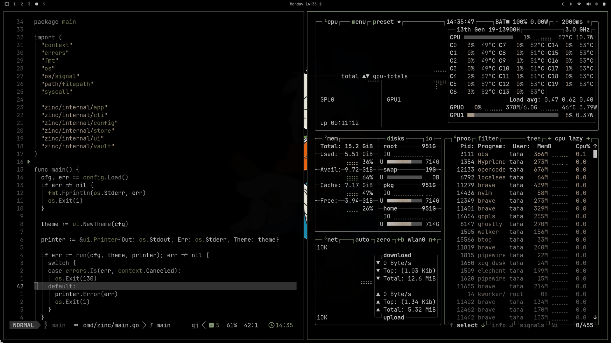

# Noir — Omarchy theme


A dark theme for the whole desktop. Pure black background, warm grey text,
muted sage accents. Includes matching VS Code, Neovim, and Zed themes.

## Preview



## Palette

| Role       | Hex       | Used for                |
| ---------- | --------- | ----------------------- |
| `bg`       | `#000000` | Background              |
| `alt_bg`   | `#1c1c1c` | Panels, hovers, status  |
| `fg`       | `#c1c1c1` | Foreground              |
| `comment`  | `#505050` | Comments                |
| `constant` | `#aaaaaa` | Constants, numbers      |
| `func`     | `#888888` | Functions               |
| `keyword`  | `#999999` | Keywords, storage       |
| `operator` | `#9b99a3` | Operators, punctuation  |
| `string`   | `#aa9988` | Strings                 |
| `type`     | `#777755` | Types, classes          |
| `visual`   | `#333333` | Selection               |
| `accent`   | `#8a9a7b` | Accent, focus, tags     |

## Contents

| File                     | Purpose                                    |
| ------------------------ | ------------------------------------------ |
| `colors.toml`            | Base palette (accent, foreground, ANSI)    |
| `hyprland.conf`          | Hyprland active border color               |
| `hyprlock.conf`          | Lock screen                                |
| `waybar.css` / `gtk.css` | Bar and GTK styling                        |
| `mako.ini`               | Notifications                              |
| `neovim.lua`             | Neovim colorscheme                         |
| `noir.zed.json`          | Zed theme                                  |
| `vscode.json`            | VS Code theme + marketplace extension      |
| `vscode-extension/`      | VS Code extension source + built vsix      |
| `backgrounds/`           | Wallpapers, sorted; first = default        |
| `preview.png`            | Theme preview for the picker               |

## VS Code

Build and install the extension:

```bash
cd vscode-extension
vsce package
code --install-extension noir-omarchy-0.1.3.vsix
```

Or install from the Marketplace: **Noir Omarchy** by `tahasadough`.

## Editing this theme

1. Edit any file here.
2. Copy changed files to your live theme dir and reapply:

   ```bash
   cp <files> ~/.config/omarchy/themes/noir/
   omarchy theme set noir
   ```

   Or edit `~/.config/omarchy/themes/noir/` directly (that dir is the live
   source; this repo is the publishable copy).

## License

MIT
