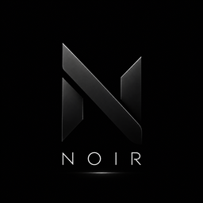

# Noir - Omarchy theme



A dark Omarchy/Hyprland theme. Pure black background, warm grey text, muted
gold accents. Includes matching Neovim and VS Code themes.

## Contents

| File               | Purpose                                            |
| ------------------ | -------------------------------------------------- |
| `colors.toml`      | Base palette (accent, foreground, ANSI colors)     |
| `neovim.lua`       | Neovim colorscheme spec + plugin                   |
| `vscode.json`      | VS Code theme name + marketplace extension         |
| `btop.theme`       | btop color theme                                   |
| `icons.theme`      | Icon set (noir-gold custom theme)                  |
| `icon.png`         | Theme/logo icon                                    |
| `backgrounds/`     | Wallpapers, sorted; first = default                |
| `preview.png`      | Theme preview for the theme picker (1800x1012)     |
| `preview-unlock.png` | Lock-screen preview (1920x1080)                  |
| `unlock.png`       | Lock-screen preview (800x378)                      |

## Editing this theme

1. Edit any file here.
2. Copy changed files to your live theme dir and reapply:

   ```bash
   cp <files> ~/.config/omarchy/themes/noir/
   omarchy theme set noir
   ```

   Or edit `~/.config/omarchy/themes/noir/` directly (that dir is the live
   source; this repo is the publishable copy).

## Installing

```bash
omarchy theme install https://github.com/tahasadough/omarchy-noir-theme.git
```

The theme name (`noir`) is derived from the repo name.

## Matching colorschemes

- **Neovim**: `tahasadough/noir.nvim` (set as `colorscheme = "noir"` in `neovim.lua`)
- **VS Code**: `tahasadough.noir-omarchy` extension (auto-installed by omarchy on theme set)

## License

MIT (c) Taha Sadough 2026
